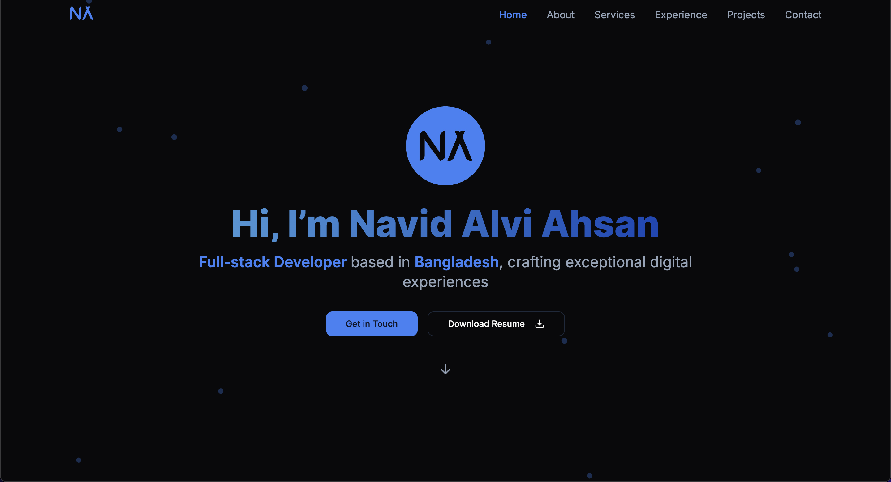

# Hi there, I'm Navid Alvi Ahsan 👋

  

## About Me 🚀

I'm a Full Stack Developer based in Bangladesh, passionate about creating exceptional digital experiences. I specialize in building modern web applications using cutting-edge technologies.

- 🔭 I'm currently working on expanding my portfolio with innovative projects
- 🌱 I'm currently learning advanced React patterns and system architecture
- 👯 I'm looking to collaborate on open source projects
- 💬 Ask me about web development, React, Next.js, or anything tech-related!

## Tech Stack 💻

### Languages

### Frontend

### Backend

### Tools & Others

## Featured Projects 🌟

### [Personal Portfolio](https://navid-alvi-ahsan.vercel.app/)
A modern, responsive portfolio website showcasing my work and skills.
- Next.js, TypeScript, Tailwind CSS, Framer Motion
- [View Source](https://github.com/navid001/portfolio)

### [Floortech Construction](https://github.com/navid001/FloorTech-Construction)
Interactive landing page for a construction company with modern animations.
- HTML, CSS, JavaScript
- Responsive design with smooth animations
- Interactive project gallery

More Projects

### [Craigslist Web Scraper](https://github.com/navid001/Craigslist-Web-Scraper)
A full-stack web scraping application built with Django and BeautifulSoup.
- Python, Django, BeautifulSoup
- Advanced search functionality
- Data export capabilities

## 📊 GitHub Stats

  
  

<!-- ## Recent Activity ⚡ -->

<!--START_SECTION:activity-->
<!-- This section will be automatically updated by GitHub Actions -->
<!--END_SECTION:activity-->

## Let's Connect! 🤝

I'm always excited to meet new people and collaborate on exciting projects.

- 💼 [LinkedIn](https://linkedin.com/in/navid-alvi-ahsan)
- 🌐 [Portfolio Website](https://navid-alvi-ahsan.vercel.app/)
- 📧 [Email Me](mailto:navidalvi.001@gmail.com)

---

  

